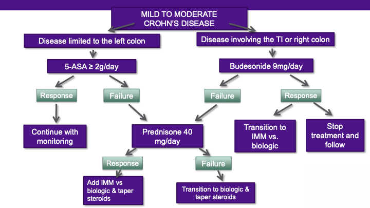
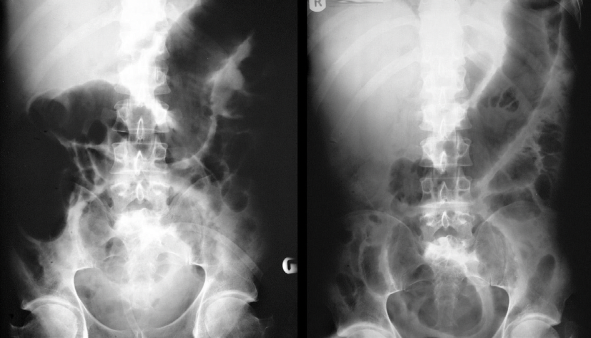

# IBD Primer
1. [Goals of Caring for Patients with IBD](#2)
2. [Mild to Moderate IBD](#25)
3. [Biologics and Small Molecules](#64)
4. [Loss of Response to IBD Therapies](#96)
5. [Pregnancy with IBD](#113)
6. [Surgery for IBD](#141)
---

# Goals of Caring for Patients with IBD

---

## Goals to be Covered
- [Goal #1: Disease Classification](#3)
- [Goal #2: Disease Management Strategy](#9)
- Goal #3: Treatment (to be covered in other lectures)
- [Goal #4: Monitoring](#10)
- [Goal #5: Taking Care of the Whole Patient](#11)

---

## Goal 1: Disease Classification1
Aim to idenfity:
- IBD Type
- Location and extend of inflammation
- Disease phenotype
- Disease activity: snashot in time
- Disease severity

---

## Crohn's Disease Burden: Low Risk2
<!-- _backgroundColor: white -->

---

# Crohn's Disease Burden: Moderate to High Risk3
<!-- _backgroundColor: white -->

---

## Disease Activity: Crohn's Disease4
- Categories include: remission, mild, moderate, and severe
- Based upon subjective measures including symptoms, QOL, and disease complications
- Can use scoring subsystems like Harvey Bradshaw, Crohn's Disease Activity Index (CDAI) but misleading

---

## Ulcerative Colitis Burden: Risk for Colectomy5
<!-- _backgroundColor: white -->

---

## Disease Activity: Ulcerative Colitis6

|  |  Remission  | Mild | Moderate-severe | Fulminant |
| - | - | - | - | - |
| Stools (no ./d) | Formed stools | <4 | >6 | >10 |       |
| Blood in stools | None | Intermittent | Frequent | Continuous |
| Urgency | None | Mild, occasional | Often | Continuous |
| Hemoglobin | Normal | Normal | <75% of normal | Transfusion required |
| ESR | <30 | <30 | >30 | >30 |
| CRP (mg/L) | Normal | Elevated | Elevated | Elevated |
| FC (µg/g) | <150-200 | >150-200 | >150-200 | >150-200 |
| Endoscopy (Mayo subscore) | 0-1 | 1 | 2-3 | 3 |
| UCEIS | 0-1 | 2-4 | 5-8 | 7-8 |

---

## Goal #2: Disease Management Strategy7
- Upon diagnosis, must provide patients with education regarding chronicity and need for ongoing therapy
- Aim to induce remission
- Avoidance of long-term exposure to steroid-based treatment regimens
- Aim to maintain remission

---

## Goal #4: Monitoring
- Historically, we assessed based on symptoms only; objective evaluation is a relatively recent paradigm shift
- Objective evaluation includes:
  - Non-invasive markers of inflammation: C-reactive protein (CRP) and fecal calprotectin)
  - Enterography
  - Colonoscopy
- Use of **treat-to-target*- approach to optimize treatment strategy and achieve remission
- Mucosal healing is a goal of therapy
- Long-term observational studies in Crohn’s disease and ulcerative colitis are still needed to assess the utility of the treat to target strategy

--- 

## Goal #5: Taking Care of the Whole Patient8

- Comprehensive care in IBD to address all aspects of disease and health needs
- Disease features warrant expertise beyond the gastroenterologist in order to provide complete care
  - Chronic, lifelong illness
  - Medical and surgical needs
  - Numerous extra-intestinal aspects of disease

---

## Needs of an Average IBD Patient

| 10 Care | ➔ | Health Maintenence |
| - | - | - |
| Pediatricians | ➔ | Transition of Care |
| Gastroenterology | ➔ | Coordination of Care |
| &emsp;- Dietician/Nutrition | ➔ | Assessment/Management |
| &emsp;- Adcanced Practitioners | ➔ | F/U, Crisis Management |
| &emsp;- Nursing | ➔ | Communications/Support |
| &emsp;- MA/s/Liaisons | ➔ | Scheduling/Authorizations |
| &emsp;- Pharmacy | ➔ | Prescriptions/Infusions |

---

## Needs of an Average IBD Patient (Continued)

| &emsp;- Social Work | ➔ | Resource utilization |
| - | - | - |
| &emsp;- Behavioral Therapy | ➔ | Self Efficay |
| &emsp;- Clinical Research | ➔ | Clinical Trials |

---

## Doctors Involved in the Care of IBD Patients

| Hospitalist | ➔ | Inpatient coordination |
| - | - | - |
| Surgeon | ➔ | Complications |
| Pathology | ➔ | Diagnostics |
| Radiology | ➔ | Diagnostic/Intervention |
| Specialists |  |  |
| &emsp;- Hepatology | ➔ | Hepatitis's |
| &emsp;- Ob/Gyne | ➔ | Contraception/Conception |
| &emsp;- Rheumatalogy | ➔ | Joints |
| &emsp;- Endocrine | ➔ | Bones |

---

## Doctors Involved in the Care of IBD Patients (Continued)

| &emsp;- Ophthalmology | ➔ | Ocular |
| - | - | - |
| &emsp;- Nephrology | ➔ | Stones/Nephropathies |
| &emsp;- Neurology | ➔ | Peripheral/Central nerves |

---

## Total Care - IBD9

<!-- _backgroundColor: white -->

---

## Under One Roof...10

Proposed collaborative care environments:
- Med/surg
  - Includes radiologist
  - Pouch clinics
- Pregnancy/preconception
  - Includes MFM specialist
  - Addresses fertility, pre-conception, therapy, delivery

---

## Under One Roof... (Continued)10
- Transition of care
  - Includes adult/child-centered care providers and support services
- Psychosocial care
- Nutrition
- Multidisciplinary conferences

---

## Preventive Care in IBD11
- For many patients, the gastroenterologist is the only provider
- Data suggest IBD patients do not receive preventive services at the same rate as general medicine patients
- Debate as to who “owns”- healthcare maintenance in IBD patient

---

## Preventive Care in IBD12
- Health maintenance is aimed at prevention and health promotion
- Areas of the focus are highlighted in 2017 ACG preventive care in IBD guideline:
  - Vaccinations
  - Skin cancer screening
  - Cervical cancer screening
  - Osteoporosis screening
  - Smoking cessation
  - Assessment for depression and anxiety

---

## Remember...
- Appreciate that “it takes a village” to effectively care for IBD 
- Be aware of preventive healthcare needs 
- Utilize IBD centers for patients with complex IBD
- Consider available resources/team members to aid in managing patients with IBD

---

# References
1. Lichtenstein GR et al. Am J Gastroenterol 2018;113(4):481-517.
2. Sandborn WJ. Gastroenterology 2014;147(3):702-705.
3. Sandborn WJ. Gastroenterology 2014;147(3):702-705.
4. Lichtenstein GR et al. Am J Gastroenterol 2018;113(4):481-517.
5. Dassapoulos T. Gastroenterology 2015;149(1):238-245.
6. Rubin DT et al. Am J Gastroenterol 2019;114(3):384-413.
  Truelove SC, Witts LJ. Br Med J 1955;2:1041-1048.
7. Lichtenstein GR et al. Am J Gastroenterol 2018;113(4):481-517.
  Rubin DT et al. Am J Gastroenterol 2019;114:384-413.

---

# References

8. Lee CK et al.  Am J Gastroenterol 2017;112(6):825-827.
  Calvet X et al. J Crohns Colitis 2014;8(3):240-251.
  Louis E et al. J Crohns Colitis 2015;9(8):685-691.
9. Regueiro MD et al. Inflamm Bowel Dis 2016;22(8):1971-1980.
10. Lee CK et al. Am J Gastroenterol 2017;112(6):825-827.
11. Melmed GY. Inflamm Bowel Dis 2012;18(1):41-42.
  Reich JS et al. Dig Dis Sci 2016;61(8):2205-2216.
  Selby L et al. Dig Dis Sci 2011;56(3):819-824.
12. Farraye FA et al. Am J Gastroenterol 2017;112(2):241-258.

---

# Mild to Moderate IBD

---

## Use of Medications for the Treatment of Mild to Moderate IBD

---

## Mild to Moderate IBD: Features 1

| Crohn’s Disease | Ulcerative Colitis |
| - | - |
| Ambulatory | Ambulatory |
| Tolerates PO | Tolerates PO |
| No systemic symptoms | No systemic symptoms |
| Age > 30 years | Age > 40 years |
| Limited ileal disease | < 4-5 bowel movements / day |
| Superficial ulcers | Limited left-sided disease |
| No perianal disease | Mild endoscopic findings |
| No penetrating disease | No hospitalizations |
| No prior surgeries | No prior C diff or CMV infection |

---

## 5-Aminosalicylates (5-ASAs) 2

- Modulate inflammatory cytokine production, decrease transcriptional activity of nuclear factor-kappa ß (NF-κ ß), inhibit production of prostaglandin and leukotrienes
  - **Work without affecting systemic immune system
- Topical contact with inflamed mucosa required; oral and rectal formulations available
- First line for induction and maintenance of mild to moderate ulcerative colitis

---

## 5-Aminosalicylates (5-ASAs) (Continued) 2
- Debated use in Crohn’s disease
  - Cochrane analysis noted sulfasalazine is superior to placebo for inducing remission in Crohn’s colitis (45% vs 29%; RR 1.38, 95% CI 1.00 to 1.89) at 17-18 weeks

---

## Rectally Introduced 5-ASAs 3

- Ideal for treating disease within 50cm from the anus or distal to the splenic flexure
- Superior to topical steroids
- 2010 Cochrane review confirmed that topical 5-ASA therapy achieves induction of remission in 67% of patients with mild to moderate disease
- Doses of at least 1g/day are warranted
- Compliance and acceptance of this strategy are integral to its success

---

## Rectally applied 5-ASA Formulations

- First-line agents for proctitis and left-sided colitis (ulcerative colitis)
- Ideal for management of tenesmus, urgency, rectal pain, incontinence, bleeding, and paradoxical constipation

10-15cm&emsp;&emsp;&emsp;&emsp;&emsp;&emsp;&emsp;&emsp;40-50cm
Suppository&emsp;&emsp;&emsp;&emsp;&emsp;&emsp;&emsp;&emsp;Foam
(mesalamine)&emsp;&emsp;&emsp;&emsp;&emsp;&emsp;&emsp;&emsp;(mesalamine*)

*Foam formulation is not available in the USA

---

## Oral ASAs 4

- Systematic review and meta-analysis show efficacy for inducing remission and preventing relapse
- Doses of ≥ 2.0g/day have greater efficacy than lower doses
- Moderate disease had improvements in clinical symptoms and rates of remission with 4.8g vs 2.4g
- All formulations show similar systemic absorption, pharmacokinetics, excretion
- Once daily dosing is comparable to divided dosing
- Decision-making based on clinical response, toxicity, compliance, and cost

---

## Oral 5-ASA Formulations

| Type | Mechanism of Action |
| - | - |
| Diffusion–dependent (**mesalamine**, controlled release) | Time-released, coated in ethylcellulose, and releases starting in upper small bowel |
| pH-dependent(mesalamine,delayed release formulations,  multi-matrix system [MMX] mesalamine) | Coated with acrylate resin and released at pH 6.0-7.0 (distal ileum or proximal colon) |
| Colonic flora-dependent; azo-bonded (sulfasalazine, balsalazide, olsalazine) | 3 different types of azo-bonded 5-ASAs, which are cleaved by colonic bacteria when the drug reaches the colon |

---

## 5-ASAs: Combined Oral & Topical Approach 5

- Meta-analysis by Ford et al evaluated oral vs topical vs combined 5-ASA therapy
  - Combined 5-ASA therapy was superior to oral 5-ASA alone for induction of remission of mildly to moderately active extensive ulcerative colitis
  - Trend toward superiority of topical over oral approach in distal ulcerative colitis
- No data on optimal dosing with this approach
- Patients who continue on the same dose from time of initiation maintain remission more frequently than those that dose de-escalate

---

## 5-ASAs: Side Effects

- Common: headache, hair loss
- Hypersensitivities
- Sulfa moiety in sulfasalazine is responsible for:
  - Hemolytic anemia
  - Reversible hypospermia, decreased sperm motility
  - Allergic phenomena
  - Nausea
- Monitoring
  - Periodic BUN and creatinine, given rare idiosyncratic cases of interstitial nephritis

---

## Corticosteroids 6
- Prevent migration of inflammatory mediators to the GI tract
- Interfere with production of nuclear factor-kappa ß (NF-
- Used to induce remission in both ulcerative colitis and Crohn’s disease
- Parenteral, oral, and rectal formulations 
- Budesonide exhibits 90% first-pass metabolism, formulated to treat local activity
- No role for long term maintenance therapy, given side effect profile

---

## Corticosteroids: Oral Use 7
- Optimum dose unclear; common use prednisone 40mg (0.5-0.75mg/kg/day) for acute symptoms
- Doses of 60mg have moderately more efficacy but at the expense of side effects
- Budesonide MMX induced clinical and endoscopic remission in 17.7% of mild to moderate ulcerative colitis patients vs 6.2% receiving placebo by 8 weeks

---

## Corticosteroids: Oral Use (Continued)
- Budesonide (enteric coated) 9mg daily is superior to placebo in induction of symptomatic remission in mild to moderate Crohn’s disease
- Standard steroids are more efficacious than budesonide preparations

---

## Corticosteroids: De-escalation 8
- Have an Exit Strategy! Tapering needs to be considered as soon as steroids are initiated to avoid adverse outcomes
- Appropriate maintenance therapy should be in place
- Once clinical response achieved, doses are tapered by 5–10mg/week until 20mg 
- Once at 20mg daily, the taper should be slowed to reduction of  2.5–5mg/week

---

## Corticosteroids: Rectal Use 9
- Topical steroids are first line for those intolerant to 5-ASA topical preparations
- Best to treat symptoms of tenesmus, urgency, rectal pain, incontinence, and bleeding
- Maybe adjunctive to topical 5-ASA therapy
- Foam and liquid enema preparations 
- Meta-analysis of budesonide foam noted that is was superior to placebo for induction of clinical remission in mild to moderate ulcerative colitis

---

## Corticosteroids: Side Effects
- Hypertension
- Glucose intolerance
- Dermatologic consequences (striae, acne)
- Infections
- Adrenal suppression
- Weight gain
- Glaucoma
- Bone loss
- Avascular necrosis 
- Psychiatric symptoms

---

## Antibiotics 10
- Use investigated due to theory that immune response to flora drives inflammation in Crohn’s disease
- Strategies evaluated include:
  - **Ciprofloxacin**
    - Similar efficacy to mesalamine 
    - No more effective than placebo for induction of remission
  - **Metronidazole**
    - No more effective than placebo
  - **Antimycobacterial agents**
    - No more effective than placebo

---

## Immunomodulators 11
- The “original” drugs for steroid-dependent or steroid-refractory patients
- These include:
  - **Thiopurines:*- azathioprine (AZA) and 6-mercaptopurine (6-MP)
    - Purine antagonists
    - Cause DNA damage, cell-cycle arrest, cytotoxicity, and apoptosis
  - **Methotrexate**
    - Converted to methotrexate-polyglutamate, which blocks de novo purine synthesis and dihydrofolate reductase, resulting in reduced inflammation and increased apoptosis

---

## Immunomodulators 12
- Lack of robust data
- Have been used for nearly 40 years for IBD
- Used for maintenance of remission; no role for induction, given delayed onset of activity (~8-12 weeks)
- Thiopurines are used in Crohn’s disease and ulcerative colitis
- AZA use more common as 6-MP does not have IBD-approved indication worldwide
- Small studies support the use of methotrexate in Crohn’s disease
- Based on existing data, currently no recommendation for methotrexate in ulcerative colitis

---

## Immunomodulators 13
| | Azathioprine | 6-Mercaptopurine | Methotrexate |
| - | - | - | - |
| Dosage | 2.0-2.5mg/kg/day | 1.0-1.5mg/kg/day | 15-25mg/week + folic acid (5-10mg/week) |
| Route of Administration | Peroral | Peroral | Intramuscular / subcutaneous injection |
| Dosing Intervals | Daily or bid | Daily or bid | Once weekly |

---

<!-- _backgroundColor: white -->

## AZA and 6-MP: Metabolism

---

## AZA and 6-MP: Thiopurine S-Methyltransferase Testing (TPMT) 14
- Some societies recommend checking TMPT prior to starting an immunomodulator
- Risk of myelosuppression with AZA and 6-MP due to elevated levels of 6-TGN
- Genotype and phenotype testing available
  - 89% wild type ⮕ normal or high TPMT activity
  - 10% heterozygous for mutations ⮕ low TPMT activity
  - 0.3% homozygous for mutations ⮕ negligible TPMT activity
- TPMT activity level can vary based on other medication exposure
- Recently discovered *NUDT15 R139C- variation can induced leukopenia in Asians
- Not all mutations are detectable, so CBC and liver enzymes must be followed periodically regardless of TMPT results

---

## AZA and 6-MP: Monitoring 15
- Baseline CBC and liver enzymes: every other week for 6 to 8 weeks after initiation or following any dose adjustments; at least once every 3 months thereafter 
- 6-thioguanine (6-TGN) and 6-methylmercaptopurine (6-MMP) levels can be measured: 2013 meta-analysis showed the pooled odds ratio for clinical remission was 3.2 when 6-TGN levels were between 230 and 260 (95% CI 2.4-4.1)
- 6-TGN levels >400 picomoles per 8 X 108 erythrocytes predict refractoriness and an increased risk of myelotoxicity 
- 6-MMP levels >5000 picomoles per 8 X 108 erythrocytes correlates with hepatotoxicity 

---

## AZA and 6-MP: Monitoring 16
| Patient Classification | 6-TGN | 6-MMP | Consequence | Approach |
| - | - | - | - | - |
| Non-compliance | Negligible or undetectable | Negligible or undetectable | Inefficacy | Patient education |
| Underdosing | Low | Low | Inefficacy or poor response | Increase thiopurine dosage |
| Thiopurine “resistant” | Low | High | Poor response or hepatotoxicity | Add allopurinol and decrease thiopurine dosage |
| Overdosing | High | Low | Overdosing with risk of myelotoxicity | Decrease thiopurine dosage and close monitoring |
| Thiopurine “refractory” | High | High | Thiopurine refractory or overdose | Switch to another drug |

---

## AZA and 6-MP: The “Resistant” Patient 17
- Characterized by low 6-TGN levels, high 6-MMP levels and often transaminitis
- Allopurinol 100mg daily directs reaction away from 6-MMP towards 6-TGN
- Requires dose reduction of AZA or 6-MP by 25%-50% to avoid myelotoxicity
- Bi-weekly CBCs needed during this adjustment phase
- Metabolite levels reassessed within 2-6 weeks

---

## AZA and 6-MP: Side Effects

| Seen early (2-3 weeks) | Seen later |
| - | - |
| Myelosuppression | Myelosuppression |
| Pancreatitis | Infection |
| Hepatitis | Malignancy |
| Polyarthralgias | &emsp;- Non melanoma skin cancers |
| Fevers | &emsp;- Cervical cancer |
| Nausea/vomiting | &emsp;- Lymphoma |

---

## Methotrexate: Side Effects
- GI distress: nausea/vomiting*
- Mouth sores*
- Headache*
- Fatigue*
- Myelosuppression
- Hepatitis
- Pulmonary fibrosis
- Infection
*Can be reduced or alleviated with folate supplementation

---

<!-- _backgroundColor: white -->

---

<!-- _backgroundColor: white -->

---

# References

1. Sandborn WJ. Gastroenterology 2014;147(3):702-705.
  Dassopoulos T et al. Gastroenterology 2015;149(1):238-245.
2. Egan LJ et al. J Biol Chem 1999;274(37):26448-26453.
  Wang YJ et al. Cochrane Review DB 2016.
  Hanauer S et al. Cochrane Review 2016.
3. Marshall JK et al. Gut 1997; 40(6): 775-781.
  Marshall KJ et al. Cochrane Database Syst Rev 2010;11.
  Marshal JK et al. Cochrane Database Syst Rev 2012;11.
  Rubin DT et al. Am J Gastro 2019;114(3):384-413.

---

# References

4. Feagan BG et al. Inflamm Bowel Dis 2013;19(9):2031-2040.
  Ford AC et al. Am J Gastroenterol 2011;106(4):601-616.
  Hanauer SB et al. Am J Gastroenterol 2005;100(11):2478-2485.
  Ford AC et al. Am J Gastroenterol 2011;106(12):2070-2077.
5. Ford AC et al. Am J Gastroenterol 2012;107(2):167-176.
  Sandborn WJ et al. Am J Gastroenterol 2005;100:S312.
6. Goulding NJ et al. Curr Opin Pharmacol 2004;4(6):629-636.
  Ford AC et al. Am J Gastroenterol 2011;106(4):590-599.
  Vavricka SR et al. Drugs 2014;74(3):319-324.

---

# References

7. Summers RW et al. Gastroenterology 1979;77 (4, pt 2):847-869.
  Baron JH et al. Br Med J 1962;2(5302):441-443.
  Ford AC et al. Am J Gastroenterol 2011;106(4):590-599.
  Sandborn WJ et al. Aliment Pharmacol Ther 2015;41(5):409-418.
8. Vavricka SR et al. Drugs 2014;74(3):319-324.
9. Seibold F et al. J Crohns Colitis 2014;8(1):56-63.
  Mulder CJ et al. Eur J Gastroenterol Hepatol 1996;8(6):549-553.
  Zeng J et al. J Gastroenterol Hepatol 2017;32(3):558-566.
10. Lichtenstein GR et al. Am J Gastro 2018;113(4):481-517.

---

# References

11. Neurath MF et al. Clin Gastroenterol Hepatol 2005;3(10):1007-1014.
  Goldman ID et al. Pharmacol Ther 1985;28(1):77-102.
  Grim J et al. Clin Pharmacokinet 2003;42(2):139-151.
12. Nielsen OH et al. Expert Rev Gastroenterol Hepatol 2015;9(2):177-189.
13. Nielsen OH et al. Expert Rev Gastroenterol Hepatol 2015;9(2):177-189.

---

# References

14. Nielsen OH et al. Expert Rev Gastroenterol Hepatol 2015;9(2):177-189.
  Lennard L et al. Clin Pharmacol Ther 1989;46(2):149-154.
  Gillisen LP et al. Aliment Pharmacol Ther 2005;22(7):605-611.
  Zhu X et al.  J Crohn's Colitis 2016;10:S475.
15. Lichtenstein GR et al. Gastroenterology 2006;130(3):935-939.
  Moreau AC et al. Inflamm Bowel Dis 2014;20(3):464-471.
  Dubinsky MC et al. Gastroenterology 2000;118(4):705-713.
  Roblin X et al. Am J Gastroenterol 2008;103(12):3115-3122.

---

# References

16. Nielsen OH et al. Expert Rev Gastroenterol Hepatol 2015;9(2):177-189.
17. Sparrow MP et al. Aliment Pharmacol Ther 2005;22(5):441-446.

---

# Biologic and Small Molecules in the Treatment of IBD

---

## Moderate to Severe IBD: Features1

| Crohn’s Disease | Ulcerative Colitis |
| - | - |
| May require hospitalization | May require hospitalization |
| May have systemic symptoms | May have systemic symptoms |
| Age < 30 years at presentation | Age < 40 years at presentation  |
| Disease NOT limited to ileal and right colon | > 4-5 bowel movements / day |
| Deep ulcers | Extensive disease |
| May have perianal disease | Moderate to severe endoscopic findings | 
| May have penetrating disease | Possible prior hospitalizations |
| Prior surgeries | Possible prior *C diff- or CMV infection |

---

<!-- _backgroundColor: white -->

## Targets of IBD Therapeutics2

---

# Biologics: Anti-TNF-α Agents

---

## Anti-Tumor Necrosis Factor-αAgents (Anti-TNFs) 3

- Blocks TNF-α, a cytokine, which modulates immune reactions as an acute phase reactant as well as impacting cell migration, proliferation, and cell death
- Used in Crohn’s disease and ulcerative colitis for disease refractory to steroids or when unable to achieve steroid sparing with other agents OR to induce remission in those presenting with more severe disease
- Often used in combination with immunomodulators

---

## Anti-Tumor Necrosis Factor-αAgents (Anti-TNFs) (Continued)

- Relatively rapid onset of action (within 2 weeks)
- Prior to initiation must assess for risk of latent or active TB and hepatitis B status

---

<!-- _backgroundColor: white -->

## Anti-TNFs4

---

## Infliximab

- First anti-TNF agent indicated in the treatment of IBD (1998)
- Only FDA-approved agent for fistulizing Crohn’s disease
- Chimeric in nature; mouse/human
- Infusion-based treatment
- Dosing: 
  - Induction: dose @ 0, 2, and 6 weeks 
  - Maintenance: every 8 weeks
  - Infusion takes ~2 hours

---

## Other Anti-TNFs: Subcutaneous Injectables

| Drug | Induction Regimen | Maintenance Regimen |
| - | - | - |
| Adalimumab | 160mg at 0 weeks 80mg  at 2 weeks 40mg at 4 weeks | 40mg every 2 weeks |
| Golimumab (**ulcerative colitis only**) | 200mg at 0 weeks 100mg at 2 weeks | 100mg every 4 weeks |
| Certolizumab (**Crohn’s disease only**) | 400mg at 0 weeks 400mg at 2 weeks 400mg at 4 weeks | 400mg every 4 weeks |

---

<!-- _backgroundColor: white -->

#### Combination Anti-TNF and Immunomodulator Treatment 5

- Combination therapy is favorable as anti-TNFs are immunogenic
- Results in:
  - Reducing anti-drug antibodies 
  - Boosting anti-TNF drug levels
- Data for combination is with anti-TNF medications; mainly infliximab with azathioprine
- SONIC trial noted superiority of infliximab + azathioprine compared to either agent alone to achieve steroid-free remission at 26 weeks in CD; UC SUCCESS noted same finding at 16 weeks in UC

---

## Anti-TNF: Patient Selection

- Careful patient selection to prevent adverse outcomes is warranted
- Avoid anti-TNFs in patients with: 
  - Uncontrolled congestive heart failure Class III & IV
  - Demyelinating conditions
  - Active tuberculosis (TB) infection
  - Prior intolerance to anti-TNFs
- Caution with anti-TNFs in patients with:
  - Prior malignancy
  - Increased risk of infection

---

## Anti-TNF: Safety Profile

- Infusion/injection site reactions:  4% of infusions
- Serum sickness:  2% of patients
- Serious infections:  2% of patients
  - Opportunistic infections:   < 0.5%
  - Reactivation of TB
  - Reactivation of hepatitis B virus
- Drug-induced lupus:   < 0.5% of patients 
- Non-Hodgkin’s lymphoma 
- Hepatosplenic T-cell lymphoma

---

# Biologics: Anti-Integrins

---

## Anti-Integrins: Natalizumab and Vedolizumab6

- **Natalizumab**
  - Humanized monoclonal Ab to α4 integrin subunit
  - Non-specific nature of α4 body inhibits lymphocyte trafficking to the CNS
  - FDA approved in Crohn’s disease, but use is limited due to risk of progressive multifocal leukoencephalopathy (PML) caused by the JC virus

---

## Anti-Integrins: Natalizumab and Vedolizumab (Continued)

- **Vedolizumab**
  - Humanized monoclonal Ab targeting α4β7 integrin
  - Targets the interaction with MAdCAM-1; gut-specific
  - No effect on CNS lymphocyte trafficking
  - FDA approved for ulcerative colitis and Crohn’s disease in 2014

---

## Vedolizumab7
- Gemini I & II trials evaluated use in UC and CD respectively
- Gemini III was focused on evaluating response to vedolizumab in prior anti-TNF failures
- Approved in moderate to severe IBD in patients with disease that has:
  - Failed anti-TNF 
  - Lost response to anti-TNF
  - Demonstrated failure/intolerance/dependence on steroids

---

## Vedolizumab (Continued)
- Dosed at 300mg with induction at weeks 0, 2, and 6 and maintenance infusion every 8 weeks; infusion lasts 30 minutes
- May take 10-12 weeks for clinical response
- Prior to initiation, must assess for risk of latent or active TB and hepatitis B status

---

## Vedolizumab: Safety Profile8
- Safety data from all 6 vedolizumab trials pooled ; up to 5 years of exposure
  - No increased risk of infections (C diff, TB, and sepsis < 0.6% patients)
  - No PML
  - < 5% reported infusion reactions
  - 18 malignancies were diagnosed 
- Risk / benefit ratio suggests that this drug is favorable for long-term use 

---

# Biologics: Anti-IL 12/23 

---

## Ustekinumab9
- Novel mechanism of action: binds to p40 subunit of IL-12 and IL-23
- IL-23 contributes to the development of T-helper-17 cells; effector cells in IBD, reducing the cascade of immune cell activation
- IL-12 and IL-23 also play a role in IBD susceptibility
- Humanized IgG1κ monoclonal antibody  
- FDA approved for use in Crohn’s disease in 2016
- Prior to initiation, assess for risk of latent or active TB and hepatitis B status

---

## Ustekinumab10
- UNITI-1 for prior anti-TNF failures / intolerance, UNITI-2 for anti-TNF-naïve patients and IM-UNITI for responders in UNITI-1&2
- Dosing:
  - Infusion is based on weight; **single dose:**
    - 260mg (< 55kg)
    - 390mg (55-85kg)
    - 520mg (> 85kg)
  - Then 90mg injection every 8 weeks 

---

## Ustekinumab: Safety Profil11
- Similar rates of adverse effects in placebo and treatment groups in trials
- Most common: nasopharyngitis and upper respiratory tract infection 
- Serious infections: diverticulitis, cellulitis, and pneumonia
- Other: headache, arthralgia, sinusitis, back pain, influenza

---

## Small Molecules vs Biologics
Small Molecules | Biologics
| - | -
Small (single molecule) | Large (mixture)
Simple well-defined structure | Complex heterogeneous structure
Produced by chemical synthesis | Produced in a living cell culture
Non-immunogenic | Immunogenic
Oral administration | Parenteral administration

---

# Small Molecules

---

## Tofacitinib
- Inhibits the JAK-STAT pathway, which impacts cytokine production and downstream inflammatory cascade
- *In vivo- directly inhibits JAK1 and JAK3
- Great oral bioavailability
- Quick onset; some patients with response within 3 days
- Short half-life
- FDA approved for ulcerative colitis in May 2018

---

## Tofacitinib: Trials12
- OCTAVE 1 & 2 are similar trials assessing tofacitinib’s ability to induce remission in moderate to severe ulcerative colitis
- OCTAVE sustain trial assessed maintenance in ulcerative colitis
- Anti-TNF-exposed patients responded as well as those who were anti-TNF-naïve
- Taken as a monotherapy
- Dosing at induction is 10mg po bid; response should occur within 8 weeks ➔ reduce to 5mg bid

---

## Tofacitinib: Monitoring13
- Check CBC at baseline, 4-8 weeks after starting, and every 3 months
- Interrupt treatment  if: 
  - Absolute lymphocyte count < 500 cells/mm3
  - Absolute neutrophil count < 1000 cells/mm3
  - Hemoglobin < 8g/dL or if hemoglobin declines more the 2g/dL on treatment

---

## Tofacitinib: Monitoring (Continued)
- Check lipids at 4-8 weeks after starting to evaluate for dose-dependent changes in lipid profile
- Routine monitoring of liver enzymes

---

## Tofacitinib: Safety Profile14
- Infection risk
  - UTI or nasopharyngitis are most common
  - Increased risk of herpes zoster; recommend Shingrix to all patients (regardless of age) prior to initiating tofacitinib
- Cardiovascular events seen in those with underlying cardiovascular disease

---

## Tofacitinib: Safety Profile (Continued)
- Pulmonary embolism: seen in rheumatoid arthritis patients with underlying cardiovascular disease; resulted in new FDA restrictions in July 2019
  - Use in patients who have failed anti-TNF treatment 
  - Caution with prior thrombosis 
  - Dose reduce to 5mg bid after 8 weeks of therapy
- Gastrointestinal perforation
- Unclear safety profile for pregnancy as of yet

---

## Moderate to Severe IBD: Therapy Considerations
| | Adalimumab | Infliximab | Vedolizumab | Tofacitinib | Ustekinumab
| - | - | - | - | - | -
Severe Disease | ++ | +++ | ++ | +++ | ++
TNF Failure | N/A | N/A | ++ | Required | +++
Onset of Action | ++ | +++ | ++ (naïve) | +++ | Pending
Immunogenic | +++ | +++ | ++ | N/A | ++
Comorbidities | ++ | ++ | +++ | ++ | +++
Elderly | ++ | ++ | +++ | ++ | +++
Pregnancy | ++ | ++ | ++ | ? | ++
EIMs | +++ | +++ | ++ | +++ | +++

---

# References
1. Sandborn WJ. Gastroenterology 2014;147(3):702-705.
  Dassopoulos T et al. Gastroenterology 2015;149(1):238-245.
2. Weisshof R, Rubin DT et al. Adv Ther  2018;35: 1764-1762.
  Coskun M et al. Trends Pharmacol Sci 2017;38: 127-142.
3. Wang YJ et al. Cochrane Review DB 2016.
  Lichtenstein GR et al. Am J Gastroenterol. 2018;113(4):481-517.
  Rubin DT et al. Am J Gastroenterol. 2019;114(3):384-413. 
4. Levin AD et al.  J Crohns Colitis 2016;10(8):989–999.

---

# References
5. Colombel JF et al. N Engl J Med 2010;362:1383-1395.
  Panaccione R et al.  Gastro 2014; 146:392-400.
6. Sandborn WJ et al. N Engl J Med 2005;353(18):1912-1925.
  Milch C et al. J Neuroimmunol 2013;264(1-2):123-126.
7. Feagin B et al. N Engl J Med 2013;369(8):699-710.
  Sandborn WJ et al.  N Engl J Med 2013;369:711-721.
  Sands B et al. Gastroenterology 2014;147(3):618-627.
8. Columbel JF et al. Gut 2017;66(5):839-851.

---

# References
9. Stelara (ustekinumab) for subcutaneous use. Horsham, PA: Janssen Biotech, March 2014 
  (package insert). Accessed August 2019.
  Feagan B et al. N Engl J Med 2016;375(20):1946-1960.
10. Feagan  B et al. N Engl J Med 2016;375(20):1946-1960.
11. Papp KA et al.  Br J Dermatol 2013;168(4):844-854.
  Sandborn et al. N Engl J Med 2012;367(16):1519-1528.
  Feagan B et al.  N Engl J Med 2016;375(20):1946-1960.
12. Sandborn WJ et al. N Engl J Med 2017;376(18):1723-173.

---

# References
13. [https://www.pfizermedicalinformation.com/en-us/xeljanz%20accessed%20August%2019](https://www.pfizermedicalinformation.com/en-us/xeljanz%20accessed%20August%2019)
14. [https://www.pfizermedicalinformation.com/en-us/xeljanz%20accessed%20August%2019](https://www.pfizermedicalinformation.com/en-us/xeljanz%20accessed%20August%2019)

---

# Management of Loss of Response to IBD Therapies

---

## Why Is This Topic Important?1
- Since IBD is a chronic, inflammatory disease, it’s important to monitor patients to ensure continued response to therapeutic strategy over time
- If symptoms recur, must confirm symptoms reported are truly related to underlying persistent inflammation
- Other etiologies that can have similar symptoms to IBD won’t respond to IBD treatments!

---

## Non-IBD Causes of Diarrhea (in the IBD Patient)
- Non-compliance
- C. difficile
  - Previous antibiotic use is not required to develop this infection
  - Usually no pseudomembranes
  - Higher morbidity and mortality rates 
  - Increased colectomy rate as high as 20%
- Neoplasm

---

## Non-IBD Causes of Diarrhea (in the IBD Patient)
- Medications  (NSAIDs, antibiotics)
- Small intestinal bacterial overgrowth
  - Can be seen in 25% of patients with Crohn’s disease
  - Risk factors: longer duration of disease, fibrostenotic disease, colonic involvement, previous/multiple surgical procedures
- Bile-salt diarrhea
  - Most commonly seen with ileal resection
- Overlapping Irritable Bowel Syndrome

---

## How to Assess the Patient with Loss of Response
- Detailed history on behaviors: 
  - smoking cessation in UC
  - New meds
  - Dietary indiscretion
- Stool studies to rule out infection
- Bloodwork including CRP level
- Fecal calprotectin level
- Colonoscopy and or cross-sectional imaging

---

## Loss of Response When Nothing Else Is to Blame...
*Maybe the medication regimen is the problem?!*
- Drug monitoring has been used for years; initially with the immunomodulator medications
- Drug monitoring with biologics is utilized more frequently today; the most data are available for infliximab (our oldest biologic medication)

---

## Why Is This TDM Important?2
- Biologics are very effective for moderate to severe IBD. 
- Nevertheless: 
  - 10%-30% of patients have primary non-response (total lack of clinical response to induction doses) 
  - Up to 50% of patients who initially respond have a secondary loss of response or serious adverse event
  - Most data on this topic exist for anti-TNF medications

---

## Pharmacokinetics of Anti-TNF Agents3
Low albumin | Increased clearance
| - | - 
CRP level | Higher CRP = increased clearance
Body mass index (BMI) | Higher BMI = increased clearance
Male sex | Increased clearance

---

## Therapeutic Drug Monitoring4
- Measures serum drug concentration and anti-drug antibodies
- Can be used to optimize biologic therapy and improve therapeutic decision making 
  - Optimal serum drug concentrations are associated with favorable outcomes in **retrospective*- analyses
  - Low or undetectable drug concentrations are linked to anti-drug antibody formation and subsequent treatment failure

---

# Therapeutic Drug Monitoring (Continued)
*
  - Drug concentrations can be directly compared between the different assays (eg, Enzyme-linked immunosorbent assay [ELISA], radio-immunoassay, homogenous mobility shift assay [HMSA]), and electrochemiluminescence immunoassay [ECLIA] for infliximab). Antibody levels cannot be compared directly. 
  - Assay choice based on cost, local availability, insurance & provider preference

---

## Optimal Trough Concentrations5
- Infliximab
  - Level of > 5mcg/mL is the **suggested*- trough level  
  - Many will dose-optimize patients to a level of > 10mcg/mL before discontinuing therapy and trying an alternate agent 
  - In perianal Crohn’s disease, higher trough levels ( ~20mcg/mL) were associated with increased fistula healing
  - Antibodies to infliximab (ATI) > 9.1U/mL during loss of remission associated with a LR of 3.6 for an unsuccessful intervention to overcome them

---

## Optimal Trough Concentrations (Continued)
- Adalimumab
  - Level of >7.5mcg/mL is the **suggested*- trough level when conducting TDM 

---

## Loss of Response Mechanisms6
Primary and secondary loss of response can be divided into: 
- **Mechanistic pharmacodynamic failure:*- optimal drug trough with failure to respond
- **Non-immune-mediated pharmacokinetic failure:*- low drug trough with absence of antibodies
- **Immune-mediated pharmacokinetic failure:*- low drug trough with either low or high antibodies

---

## Types of Therapeutic Drug Monitoring
- Reactive TDM
  - When symptoms worsen
  - Improves clinical care
  - Cost-effective
- Proactive TDM
  - During induction or maintenance
  - Withdrawing therapy
  - Data (mainly retrospective) show improved outcomes

---

<!-- _backgroundColor: white -->

---

<!-- _backgroundColor: white -->

---

# References
1. Papamichael K et al. Inflamm Bowel Dis 2015;21(1):182-197.
2. Papamichael K et al. Inflamm Bowel Dis 2015;21(1):182-197.
3. Ordas I et al. Clin Pharmacol Ther 2012;91(4):635-646.
4. Papamichael K and Cheifetz A.  Frontline Gastroenterol 2016;7(4): 289-300.
5. Feuerstein JD et al. Gastroenterology 2017;153:827-834.
  Casteele NV et al. Am J Gastroenterol 2013;108:962-971.
  Yarur A et al. Aliment Pharmacol Ther 2017;45(7):933-940.
6. Vande Casteele N et al. Gastroenterology 2017;153:835-857 e6.

---

# Pregnancy and the Patient with IBD

---

## Why Is This Topic Important?1
- Most patients are diagnosed with IBD between ages 20-40 years, which coincides with childbearing years
- IBD affects men and women equally
- Multidisciplinary care is warranted to achieve the best outcomes
- Many providers and patients are fearful of treatment during pregnancy and lactation
- Worsening disease activity is the greatest predictor of poor pregnancy outcomes for an patient with IBD
- Little evidence for many recommendations, since pregnant women are excluded from trials

---

## Known Risks for the Pregnant Patient with IBD
- Miscarriage
- Growth retardation
- Premature delivery
- Delivery complications
- Disease exacerbation

---

# Planning and the Care Team

---

## Preconception Planning2
- Ideal for individuals to be in remission 3-6 months prior to conception to increase likelihood of quiescence during pregnancy and in postpartum period
- Preconception visit is ideal to assess:
  – Disease state
  – Therapy plan
  – Nutritional status
  – Smoking cessation
  – Body weight

---

## Preconception Planning3
- Contraception: long-acting, reversible, and non-hormonal
  – Mindful of venous thromboembolism risk
  – Consider reduced efficacy of oral contraceptive pills with small bowel disease / resection
- Fertility rates in IBD are equivalent to non-IBD patients
- Patients with prior surgery including ileal pouch-anal anastomosis, ostomies, and proctectomy exhibit reduced fertility rates due to inflammation and fallopian tube scarring
- Active inflammation may also reduce fertility
- Increase in voluntary childlessness compared to non-IBD patients

---

## Ideal Care Team Roster4
The captains:
  1. Gastroenterologist with IBD expertise 
  2. Maternal-fetal medicine specialist

Access to, as needed: 
  1. Colorectal surgeon 
  2. Nutritionist
  3. Lactation consultant

**With knowledge and understanding of principles for managing IBD during pregnancy, you can manage these patients, too!**

---

# Disease Management

---

## Healthcare Maintenance5
- Use of prenatal vitamins is recommended, start early
- Iron may cause constipation can be managed with most over-the-counter preparations 
- Inadequate gestational weight gain has been tied to increased risk for small-for-gestational age infants born to mothers with IBD

---

## Medication Options: What Not To Use!6
- Steroids for maintenance
  – Best for patients to be in remission off steroids for 3 months before conception
  – May increase the risk of gestational diabetes, preterm birth, and low birthweight
- Methotrexate must be held 3 months before conception, given known teratogenecity

---

## Medication Options: What Not To Use! (Continued)
- Limited data for use of tofacitinib during pregnancy; 11 maternal exposures in the >1100 patients in the ulcerative colitis trials; most common outcome was healthy newborn
- Animal studies with tofacitinib have demonstrated fetal malformation at high doses; encouraged to avoid during the first trimester

---

## Medication Options: What Not To Use!
- Steroids for maintenance
  – Best for patients to be in remission off steroids for 3 months before conception
  – May increase the risk of gestational diabetes, preterm birth, and low birthweight
- Methotrexate must be held 3 months before conception, given known teratogenecity

---

## Medication Options: What Not To Use!
- Limited data for use of tofacitinib during pregnancy; 11 maternal exposures in the >1100 patients in the ulcerative colitis trials; most common outcome was healthy newborn
- Animal studies with tofacitinib have demonstrated fetal malformation at high doses; encouraged to avoid during the first trimester

---

## Medical Therapy7
- 5-ASA agents (oral and topical) may be continued throughout pregnancy 
  – All preparations are currently phthalate free
- Thiopurine monotherapy can be continued
  – Increased renal clearance may lower levels
  – Initiation during pregnancy is not recommended

---

## Medical Therapy (Continued)
- Steroids can be used as needed for flares
- Biologics can be continued with last dose timed during third trimester, ideally to deliver during trough
- Combination therapy is discouraged if possible, due to concern of infection risk

---

## Medical Therapy: Biologics8
Drug | |
| - | -
Infliximab | Last infusion 6-10 weeks before delivery; resume postpartum
Adalimumab | Last injection 2-3 weeks before delivery; resume postpartum
Certolizumab | Continue uninterrupted
Golimumab | Last injection 4-6 weeks before delivery; resume postpartum
Vedolizumab | Last infusion 6-10 weeks before delivery; resume postpartum
Ustekinumab | Last infusion 6-10 weeks before delivery; resume postpartum

**Can resume biologics 24 hours after vaginal delivery and 48 hours after C-section**

---

## Disease Activity in Pregnancy: Assessment9
- 1/3 of patients will flare during their pregnancy
- Quiescence at the time of conception helps protect again flares
- Assessment of disease with endoscopy or imaging can be considered if findings will alter management
- Lab alterations may be seen in pregnancy including: 
  – Anemia
  – Reduced albumin
  – Elevated alk phos

---

## Disease Activity in Pregnancy10
- Flexible sigmoidoscopy can be performed (unsedated and unprepped) any time during gestation
- Colonoscopy after 24 weeks’ gestation may put the patient and pregnancy at risk
- Gadolinium should be avoided in pregnancy

---

<!-- _backgroundColor: white -->

## Active Disease11

---

## Perianal Disease in Pregnancy11
- Active perianal disease can be treated with standard of care measures
- Active disease (fistulas, fissures, stenosis) increase the risk of a 4th
degree tear 10x
- Thorough perianal exam during 3rd trimester can help determine the best mode of delivery
- Cesarean section is recommend for:
  – Prior rectovaginal fistula
  – Active perianal disease at the time of delivery
  – Special consideration for those with IPAA given need to preserve anal sphincter

---

# After Delivery

---

## Postpartum Needs: Thromboembolic Risk12
- IBD patients are at an increased risk for venous thromboembolism, as are pregnant women
- Mechanical prophylaxis and early ambulation are needed for all IBD patients after delivery
- Patients with C-section should be treated with prophylactic anticoagulation after surgery; course may extend up to 3-6 weeks postpartum

---

## Postpartum Needs: Pain Management13
- Short courses of opioids can be used
- Avoidance of codeine and tramadol
- Avoidance of NSAIDs, if possible
- Consideration of constipation and ileus, caused by pain medications

---

## Recommendations for the Newborn14
- Vaccines should be given on schedule
- Any baby exposed to a biologic during the third trimester should NOT be given live vaccines in the first 6 months of life
- Rotavirus delivery is the only impacted vaccine
- Live vaccines indicated at age 1 year (MMR, Varicella) can be given to breastfed babies of mothers taking biologics

---

## Resources
For Providers | For Patients
| - | - 
[Inflammatory Bowel Disease (IBD) in Pregnancy Clinical Care Pathway: A Report from the American Gastroenterological Association IBD Parenthood Project Working Group](https://www.gastrojournal.org/article/S0016-5085(18)35437-4/fulltext) | First standardized work flow for providers treating IBD patients through family planning
First standardized work flow for providers treating IBD patients through family planning

---

# References
1. Mahadaven U et al. Gastroenterology 2019;156(5):1508-1524.
2. Pedersen N et al. Aliment Pharmacol Ther 2013;38(5):501-512.
  Mahadaven U et al. Gastroenterology 2019;156(5):1508-1524.
3. Mahadaven U et al. Gastroenterology 2019;156(5):1508-1524.
  Rajaratnam SG et al. Int J Colorectal Dis 2011;26(11):1365-1374.
  Wikland M et al. Int J Colorectal Dis 1990;5(1):49-52.
4. Mahadaven U et al. Gastroenterology 2019;156(5):1508-1524.
5. Mahadaven U et al. Gastroenterology 2019;156(5):1508-1524. 
  Bengtson MB et al. Inflamm Bowel Dis 2017; 23(7):1225-1233.

---

# References
6. Mahadaven U et al. Gastroenterology 2019;156(5):1508-1524.
  Mahadaven U et al. Inflamm Bowel Dis 2018;24(12):2494-2500.
7. Mahadaven U et al. Gastroenterology 2019;156(5):1508-1524.
8. Mahadaven U et al. Gastroenterology 2019;156(5):1508-1524.
9. Caprilli R et al. Gut 2006;55(Supp 1):i36-i58.
  Abhyankar A et al. Aliment Pharmacol Ther 2013;38(5):460-466.
  Mahadaven U et al. Gastroenterology 2019;156(5):1508-1524.
10. Mahadaven U et al. Gastroenterology 2019;156(5):1508-1524.

---

# References
11. Copyright © 2016 AGA Institute.
  Nguyen GC et al. Gastroenterology 2016;150(3):734-757.
12. Nguyen GC et al. Gastroenterology 2016;150(3):734-757.
  Mahadaven U et al. Gastroenterology 2019;156(5):1508-1524.
13. Nguyen GC et al. Gastroenterology 2014;146(3):835-848.
14. ACOG Committee Opinion No. 742. Obstet Gynecol 2018;132(1):e35-e43.
15. Mahadaven U et al. Gastroenterology 2019;156(5):1508-1524.

---

# Surgical Considerations in IBD

---

## Surgery does NOT represent a medical failure, rather it is one of the treatment options.

---

## Risk of Requiring Surgery for IBD Management1
**Crohn’s disease**
- 1 year: 16.3%
- 5 years: 33.3%
- 10 years: 46.6%
- Cumulative: up to 70%-90% in some reports
**Ulcerative colitis**
- Cumulative risk of surgery over 25%

---

# Crohn’s Disease Surgeries

---

## Indications for Surgery2
- Persisting or recurrent obstruction
- Abscess
- Cancer
- Hemorrhage
- Bowel perforation 
- Poor quality of life

---

## Crohn’s Disease Surgery3
- Most common indication is for fibrostenotic disease segment
- Second most common indication is penetrating disease resulting in abscess or phlegmon usually in:
  — Presence of fistula
  — Presence of sinus

---

<!-- _backgroundColor: white -->

## Stricturing Disease4
- Approximately 19%-38% of patients with Crohn’s disease have stricturing or penetrating disease at the time of diagnosis
- 61%-88% will develop stricturing or penetrating disease after 20 years of disease

---

## Considerations for Surgery in Stricturing Crohn’s Disease
- Long stricture (> 4cm)
- Multiple strictures
- Strictures with associated abscesses or fistulae
- Suspicion of cancer as cause of blockage

---

## Considerations for Surgery in Stricturing Crohn’s Disease (Continued)
- Surgical options: 
  — Resection
  — Stricturoplasty
    - “Bowel-sparing” as it does not result in resection, but rather in reconfiguring the bowel to relieve a physical obstruction
    - Technique and reconfiguration depend on the length of the stricture and number of strictures to managed

---

<!-- _backgroundColor: white -->

## Fistulas and Abscesses in Crohn’s Disease

---

## Management of Abscesses in Crohn’s Disease5

- Surgery is not always indicated
- Antibiotics should always be given
  - Abscesses < 3cm may be treated with antibiotics alone
- If possible, abscesses should be drained by interventional radiology
- Once abscess is drained biologics can be initiated
- Most patients who develop an abscess will need to undergo (delayed) resection
- Untreated abscess and phlegmon prior to surgery are associated with sepsis, leaks, and mortality postoperatively
- Long-term abscess resolution without surgery is unlikely (OR 3.44)

---

## Perianal Fistulas and Abscesses6
- Seen in approximately 25%-33% of patients with Crohn’s disease; most common fistula site
- Best evaluated with MRI of the pelvis
- Combined medical and surgical approach improves outcomes
- Exam under anesthesia with seton placement in the setting of abscesses, followed by initiation of anti-TNF medications
- Diverting colostomy in refractory cases

---

## Crohn’s Disease and Colorectal Cancer7
- Increased risk of colon cancer in Crohn’s disease, based on time since Crohn’s disease diagnosis and extent of disease
- Relative risk is 2.5 in CD and 5.6 in colonic CD
- Surveillance is recommended after 8 years of disease if > 30% of the colon is involved
- Slight increased risk of small intestinal cancer in Crohn’s disease with small intestinal involvement
  – 0.5/1000 person-years after 8 years
  – No surveillance recommended for this group

---

# Ulcerative Colitis Surgeries

---

## Indications for Surgery in Ulcerative Colitis
- Acute severe ulcerative colitis (ASUC) — Toxic megacolon
  — Perforation
  — Massive bleeding
  — Refractory to or intolerant of medical therapies
- Cancer

---

<!-- _backgroundColor: white -->

## Toxic Megacolon

---

## Toxic Megacolon
But...
**Don’t have to have radiologic evidence to have toxic megacolon or to require surgery**

---

## Surgery in the Urgent Setting
- Subtotal colectomy is the preferred surgery with end ileostomy and Hartmann’s pouch creation
- Rectal mucosectomy and ileoanal pull-through are deferred until the patient is optimized
  – Nutritional status
  – Off steroids
  – Center of Excellence

---

<!-- _backgroundColor: white -->

## Ulcerative Colitis Surgical Options

---

## Ileal Pouch Anal Anastomosis (IPAA)
- Most common surgery performed to restore bowel function in UC
- Important to set the patients expectations prior to surgery: 
  — Usually have 4-8 bms/day
  — Likely to have nocturnal BMs
  — Many experience incontinence that increases over time
- Most will have a 3-stage set of surgeries
  1. Subtotal colectomy
  2. Rectal mucosectomy and pouch creation with diverting loop ileostomy (DLI) 
  3. Takedown of DLI

---

## Ulcerative Colitis and Colon Cancer8
- Increased risk of colon cancer, based on time since ulcerative colitis diagnosis, extent of disease, and disease severity
- Standardized incidence ratio 7 compared to the general population 
  - Surveillance is recommended after 8-10 years of disease
  - Surveillance can start after 10-15 years of disease in limited left-sided disease

---

# References
1. Frolkis AD et al. Gastroenterology 2013;145(5):996-1006. 
  Nguyen GC et al. Gastroenterology 2011;141(1):90-97. 
  Bouguen G, Peyrin-Biroulet L. Gut 2011;60(9):1178-1181. 
  Turner D et al. Clin Gastroenterol Hepatol 2007;5(1):103-110.
2. Travis SP et al. Gut 2006;55(suppl 1):i16-i35.
3. Lichtenstein GR et al. Am J Gastroenterol 2018;113(4):481-517.
4. Louis E. Dig Dis 2012;30(4):376-379.

---

# References
5. Patel KV et al. Nat Rev Gastroenterol Hepatol 2016;13(12):707-719.
  Nguyen DL et al. Eur J Gastroenterol Hepatol 2015;27(3):235-241. 
  Kim Dh et al. Korean J Gastroenterol 2009; 53:29-35.
6. Lichtenstein GR et al. Am J Gastroenterol 2018;113(4):481-517.
7. Beaugerie L, Itzkowitz SH. N Engl J Med 2015;372(15):1441-1452. Huang LC, Merchea A. Surg Clin North Am 2017;97(3):627-639.
8. Beaugerie L, Itzkowitz SH. N Engl J Med 2015;372(15):1441-1452. Huang LC, Merchea A. Surg Clin North Am 2017;97(3):627-639.